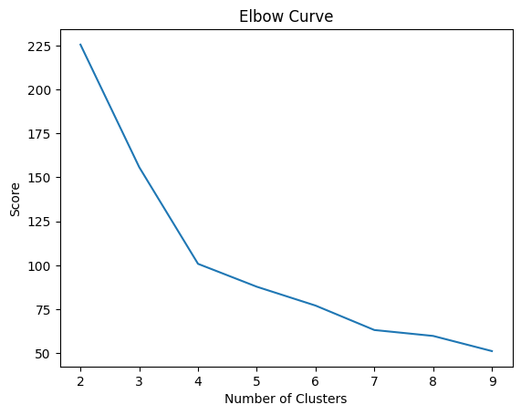
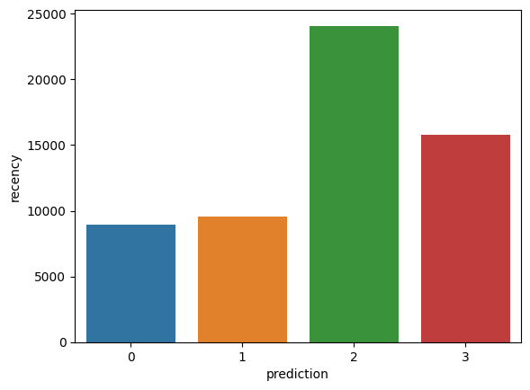
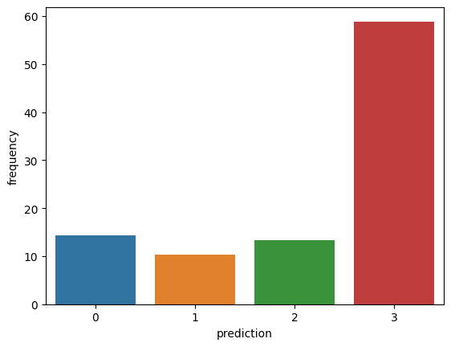
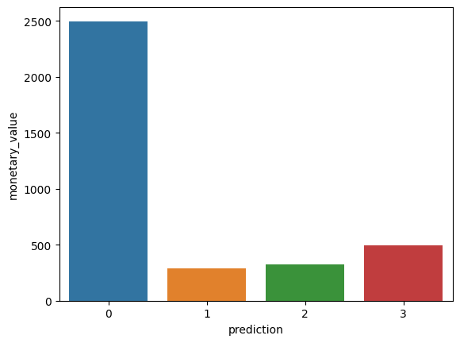

TM: karu samuel

date: 17/06/2024

lecture: Introduction to Big Data Concepts and Tools

# Big data Practical example

## Step 1: Creating a SparkSession


```python
# import pysSpark,sparkSession

import pyspark
from pyspark.sql import SparkSession
```


```python
# initialize spark session
spark = SparkSession.builder.appName("E-commerce App").config("spark.memory.offHeap.enabled","true").config('spark.sql.legacy.timeParserPolicy','LEGACY').config("spark.memory.offHeap.size","10g").getOrCreate()
```

    Setting default log level to "WARN".
    To adjust logging level use sc.setLogLevel(newLevel). For SparkR, use setLogLevel(newLevel).
    24/07/17 09:15:09 WARN NativeCodeLoader: Unable to load native-hadoop library for your platform... using builtin-java classes where applicable


## Step 2: Creating the DataFrame


```python
# load data
df = spark.read.csv('./data/e-commerce_data.csv',header=True,escape="\"")
```


```python
df.show(5,0)
```

    +---------+---------+-----------------------------------+--------+------------+---------+----------+--------------+
    |InvoiceNo|StockCode|Description                        |Quantity|InvoiceDate |UnitPrice|CustomerID|Country       |
    +---------+---------+-----------------------------------+--------+------------+---------+----------+--------------+
    |536365   |85123A   |WHITE HANGING HEART T-LIGHT HOLDER |6       |12/1/10 8:26|2.55     |17850     |United Kingdom|
    |536365   |71053    |WHITE METAL LANTERN                |6       |12/1/10 8:26|3.39     |17850     |United Kingdom|
    |536365   |84406B   |CREAM CUPID HEARTS COAT HANGER     |8       |12/1/10 8:26|2.75     |17850     |United Kingdom|
    |536365   |84029G   |KNITTED UNION FLAG HOT WATER BOTTLE|6       |12/1/10 8:26|3.39     |17850     |United Kingdom|
    |536365   |84029E   |RED WOOLLY HOTTIE WHITE HEART.     |6       |12/1/10 8:26|3.39     |17850     |United Kingdom|
    +---------+---------+-----------------------------------+--------+------------+---------+----------+--------------+
    only showing top 5 rows
    


## Step 3: Exploratory Data Analysis

Number of rows in our dataset


```python
# count number of rows in data set
df.count() 
```


    2500


customers are present in the dataframe?


```python
# count unique customers in our dataset
df.select('CustomerID').distinct().count() # Answer: 95
```


    95


What country do most purchases come from?


```python
# imports
from pyspark.sql.functions import *
from pyspark.sql.types import *

# find whwre most purchases come from


df.groupBy('Country').agg(countDistinct('CustomerID').alias('country_count')).show()
```

    +--------------+-------------+
    |       Country|country_count|
    +--------------+-------------+
    |       Germany|            2|
    |        France|            1|
    |          EIRE|            1|
    |        Norway|            1|
    |     Australia|            1|
    |United Kingdom|           88|
    |   Netherlands|            1|
    +--------------+-------------+
    


 When was the most recent purchase made by a customer on the e-commerce platform?

* *To find when the latest purchase was made on the platform, we need to convert the “InvoiceDate” column into a timestamp format and use the max() function in Pyspark:*


```python
# find most recent purchase

spark.sql("set spark.sql.legacy.timeParserPolicy=LEGACY")
df = df.withColumn('date',to_timestamp("InvoiceDate", 'yy/MM/dd HH:mm'))
df.select(max("date")).show()
```

    +-------------------+
    |          max(date)|
    +-------------------+
    |2012-01-10 17:06:00|
    +-------------------+
    


```python
df.show(5,0)
```

    +---------+---------+-----------------------------------+--------+------------+---------+----------+--------------+-------------------+
    |InvoiceNo|StockCode|Description                        |Quantity|InvoiceDate |UnitPrice|CustomerID|Country       |date               |
    +---------+---------+-----------------------------------+--------+------------+---------+----------+--------------+-------------------+
    |536365   |85123A   |WHITE HANGING HEART T-LIGHT HOLDER |6       |12/1/10 8:26|2.55     |17850     |United Kingdom|2012-01-10 08:26:00|
    |536365   |71053    |WHITE METAL LANTERN                |6       |12/1/10 8:26|3.39     |17850     |United Kingdom|2012-01-10 08:26:00|
    |536365   |84406B   |CREAM CUPID HEARTS COAT HANGER     |8       |12/1/10 8:26|2.75     |17850     |United Kingdom|2012-01-10 08:26:00|
    |536365   |84029G   |KNITTED UNION FLAG HOT WATER BOTTLE|6       |12/1/10 8:26|3.39     |17850     |United Kingdom|2012-01-10 08:26:00|
    |536365   |84029E   |RED WOOLLY HOTTIE WHITE HEART.     |6       |12/1/10 8:26|3.39     |17850     |United Kingdom|2012-01-10 08:26:00|
    +---------+---------+-----------------------------------+--------+------------+---------+----------+--------------+-------------------+
    only showing top 5 rows
    


## Step 4: Data Pre-processing

The variables in this dataset are in a format that cannot be easily ingested into the customer segmentation model. These features individually do not tell us much about customer purchase behavior.

Due to this, we will use the existing variables to derive three new informative features - recency, frequency, and monetary value (RFM).

RFM is commonly used in marketing to evaluate a client’s value based on their:

- **Recency:** 

    *How recently has each customer made a purchase?*

- **Frequency:** 

    *How often have they bought something?*

- **Monetary Value:** 

    *How much money do they spend on average when making purchases?*


```python
# show top 5 rows

df.show(5,0)
```

    +---------+---------+-----------------------------------+--------+------------+---------+----------+--------------+-------------------+
    |InvoiceNo|StockCode|Description                        |Quantity|InvoiceDate |UnitPrice|CustomerID|Country       |date               |
    +---------+---------+-----------------------------------+--------+------------+---------+----------+--------------+-------------------+
    |536365   |85123A   |WHITE HANGING HEART T-LIGHT HOLDER |6       |12/1/10 8:26|2.55     |17850     |United Kingdom|2012-01-10 08:26:00|
    |536365   |71053    |WHITE METAL LANTERN                |6       |12/1/10 8:26|3.39     |17850     |United Kingdom|2012-01-10 08:26:00|
    |536365   |84406B   |CREAM CUPID HEARTS COAT HANGER     |8       |12/1/10 8:26|2.75     |17850     |United Kingdom|2012-01-10 08:26:00|
    |536365   |84029G   |KNITTED UNION FLAG HOT WATER BOTTLE|6       |12/1/10 8:26|3.39     |17850     |United Kingdom|2012-01-10 08:26:00|
    |536365   |84029E   |RED WOOLLY HOTTIE WHITE HEART.     |6       |12/1/10 8:26|3.39     |17850     |United Kingdom|2012-01-10 08:26:00|
    +---------+---------+-----------------------------------+--------+------------+---------+----------+--------------+-------------------+
    only showing top 5 rows
    


### Recency

i) **Assign a recency score to each customer**

We will subtract every date in the dataframe from the earliest date. This will tell us how recently a customer was seen in the dataframe. A value of 0 indicates the lowest recency, as it will be assigned to the person who was seen making a purchase on the earliest date.


```python
#calculate Recency
df = df.withColumn("from_date", lit("12/1/10 08:26"))
df = df.withColumn('from_date',to_timestamp("from_date", 'yy/MM/dd HH:mm'))

df2=df.withColumn('from_date',to_timestamp(col('from_date'))).withColumn('recency',col("date").cast("long") - col('from_date').cast("long"))
```


```python
df2.show(20,0)
```

    +---------+---------+-----------------------------------+--------+------------+---------+----------+--------------+-------------------+-------------------+-------+
    |InvoiceNo|StockCode|Description                        |Quantity|InvoiceDate |UnitPrice|CustomerID|Country       |date               |from_date          |recency|
    +---------+---------+-----------------------------------+--------+------------+---------+----------+--------------+-------------------+-------------------+-------+
    |536365   |85123A   |WHITE HANGING HEART T-LIGHT HOLDER |6       |12/1/10 8:26|2.55     |17850     |United Kingdom|2012-01-10 08:26:00|2012-01-10 08:26:00|0      |
    |536365   |71053    |WHITE METAL LANTERN                |6       |12/1/10 8:26|3.39     |17850     |United Kingdom|2012-01-10 08:26:00|2012-01-10 08:26:00|0      |
    |536365   |84406B   |CREAM CUPID HEARTS COAT HANGER     |8       |12/1/10 8:26|2.75     |17850     |United Kingdom|2012-01-10 08:26:00|2012-01-10 08:26:00|0      |
    |536365   |84029G   |KNITTED UNION FLAG HOT WATER BOTTLE|6       |12/1/10 8:26|3.39     |17850     |United Kingdom|2012-01-10 08:26:00|2012-01-10 08:26:00|0      |
    |536365   |84029E   |RED WOOLLY HOTTIE WHITE HEART.     |6       |12/1/10 8:26|3.39     |17850     |United Kingdom|2012-01-10 08:26:00|2012-01-10 08:26:00|0      |
    |536365   |22752    |SET 7 BABUSHKA NESTING BOXES       |2       |12/1/10 8:26|7.65     |17850     |United Kingdom|2012-01-10 08:26:00|2012-01-10 08:26:00|0      |
    |536365   |21730    |GLASS STAR FROSTED T-LIGHT HOLDER  |6       |12/1/10 8:26|4.25     |17850     |United Kingdom|2012-01-10 08:26:00|2012-01-10 08:26:00|0      |
    |536366   |22633    |HAND WARMER UNION JACK             |6       |12/1/10 8:28|1.85     |17850     |United Kingdom|2012-01-10 08:28:00|2012-01-10 08:26:00|120    |
    |536366   |22632    |HAND WARMER RED POLKA DOT          |6       |12/1/10 8:28|1.85     |17850     |United Kingdom|2012-01-10 08:28:00|2012-01-10 08:26:00|120    |
    |536367   |84879    |ASSORTED COLOUR BIRD ORNAMENT      |32      |12/1/10 8:34|1.69     |13047     |United Kingdom|2012-01-10 08:34:00|2012-01-10 08:26:00|480    |
    |536367   |22745    |POPPY'S PLAYHOUSE BEDROOM          |6       |12/1/10 8:34|2.1      |13047     |United Kingdom|2012-01-10 08:34:00|2012-01-10 08:26:00|480    |
    |536367   |22748    |POPPY'S PLAYHOUSE KITCHEN          |6       |12/1/10 8:34|2.1      |13047     |United Kingdom|2012-01-10 08:34:00|2012-01-10 08:26:00|480    |
    |536367   |22749    |FELTCRAFT PRINCESS CHARLOTTE DOLL  |8       |12/1/10 8:34|3.75     |13047     |United Kingdom|2012-01-10 08:34:00|2012-01-10 08:26:00|480    |
    |536367   |22310    |IVORY KNITTED MUG COSY             |6       |12/1/10 8:34|1.65     |13047     |United Kingdom|2012-01-10 08:34:00|2012-01-10 08:26:00|480    |
    |536367   |84969    |BOX OF 6 ASSORTED COLOUR TEASPOONS |6       |12/1/10 8:34|4.25     |13047     |United Kingdom|2012-01-10 08:34:00|2012-01-10 08:26:00|480    |
    |536367   |22623    |BOX OF VINTAGE JIGSAW BLOCKS       |3       |12/1/10 8:34|4.95     |13047     |United Kingdom|2012-01-10 08:34:00|2012-01-10 08:26:00|480    |
    |536367   |22622    |BOX OF VINTAGE ALPHABET BLOCKS     |2       |12/1/10 8:34|9.95     |13047     |United Kingdom|2012-01-10 08:34:00|2012-01-10 08:26:00|480    |
    |536367   |21754    |HOME BUILDING BLOCK WORD           |3       |12/1/10 8:34|5.95     |13047     |United Kingdom|2012-01-10 08:34:00|2012-01-10 08:26:00|480    |
    |536367   |21755    |LOVE BUILDING BLOCK WORD           |3       |12/1/10 8:34|5.95     |13047     |United Kingdom|2012-01-10 08:34:00|2012-01-10 08:26:00|480    |
    |536367   |21777    |RECIPE BOX WITH METAL HEART        |4       |12/1/10 8:34|7.95     |13047     |United Kingdom|2012-01-10 08:34:00|2012-01-10 08:26:00|480    |
    +---------+---------+-----------------------------------+--------+------------+---------+----------+--------------+-------------------+-------------------+-------+
    only showing top 20 rows
    


ii) **Select the most recent purchase**

One customer can make multiple purchases at different times. We need to select only the last time they were seen buying a product, as this is indicative of when the most recent purchase was made: 


```python
# Unique customer most recent purchase
df2 = df2.join(df2.groupBy('CustomerID').agg(max('recency').alias('recency')),on='recency',how='leftsemi')
```


```python
# count rows
df2.count()
```


    1743


```python
df2.show(5,0)
#df2.printSchema()
```

    +-------+---------+---------+-------------------------------+--------+------------+---------+----------+--------------+-------------------+-------------------+
    |recency|InvoiceNo|StockCode|Description                    |Quantity|InvoiceDate |UnitPrice|CustomerID|Country       |date               |from_date          |
    +-------+---------+---------+-------------------------------+--------+------------+---------+----------+--------------+-------------------+-------------------+
    |540    |536369   |21756    |BATH BUILDING BLOCK WORD       |3       |12/1/10 8:35|5.95     |13047     |United Kingdom|2012-01-10 08:35:00|2012-01-10 08:26:00|
    |1140   |536370   |22728    |ALARM CLOCK BAKELIKE PINK      |24      |12/1/10 8:45|3.75     |12583     |France        |2012-01-10 08:45:00|2012-01-10 08:26:00|
    |1140   |536370   |22727    |ALARM CLOCK BAKELIKE RED       |24      |12/1/10 8:45|3.75     |12583     |France        |2012-01-10 08:45:00|2012-01-10 08:26:00|
    |1140   |536370   |22726    |ALARM CLOCK BAKELIKE GREEN     |12      |12/1/10 8:45|3.75     |12583     |France        |2012-01-10 08:45:00|2012-01-10 08:26:00|
    |1140   |536370   |21724    |PANDA AND BUNNIES STICKER SHEET|12      |12/1/10 8:45|0.85     |12583     |France        |2012-01-10 08:45:00|2012-01-10 08:26:00|
    +-------+---------+---------+-------------------------------+--------+------------+---------+----------+--------------+-------------------+-------------------+
    only showing top 5 rows
    


### Frequency

Let’s now calculate the value of frequency - how often a customer bought something on the platform. To do this, we just need to group by each customer ID and count the number of items they purchased:


```python
# count the frequency of customers
df_freq = df2.groupBy('CustomerID').agg(count('InvoiceDate').alias('frequency'))
```


```python
df_freq.show(5,0)
```

    +----------+---------+
    |CustomerID|frequency|
    +----------+---------+
    |16250     |14       |
    |15100     |1        |
    |13065     |14       |
    |12838     |59       |
    |15350     |5        |
    +----------+---------+
    only showing top 5 rows
    


There is a frequency value appended to each customer in the dataframe. This new dataframe only has two columns, and we need to join it with the previous one:


```python
# merge frequency dataframe to main dataframe

df3 = df2.join(df_freq,on='CustomerID',how='inner')
```


```python
df3.show(5,0)
```

    +----------+-------+---------+---------+-------------------------------+--------+------------+---------+--------------+-------------------+-------------------+---------+
    |CustomerID|recency|InvoiceNo|StockCode|Description                    |Quantity|InvoiceDate |UnitPrice|Country       |date               |from_date          |frequency|
    +----------+-------+---------+---------+-------------------------------+--------+------------+---------+--------------+-------------------+-------------------+---------+
    |13047     |540    |536369   |21756    |BATH BUILDING BLOCK WORD       |3       |12/1/10 8:35|5.95     |United Kingdom|2012-01-10 08:35:00|2012-01-10 08:26:00|1        |
    |12583     |1140   |536370   |22728    |ALARM CLOCK BAKELIKE PINK      |24      |12/1/10 8:45|3.75     |France        |2012-01-10 08:45:00|2012-01-10 08:26:00|20       |
    |12583     |1140   |536370   |22727    |ALARM CLOCK BAKELIKE RED       |24      |12/1/10 8:45|3.75     |France        |2012-01-10 08:45:00|2012-01-10 08:26:00|20       |
    |12583     |1140   |536370   |22726    |ALARM CLOCK BAKELIKE GREEN     |12      |12/1/10 8:45|3.75     |France        |2012-01-10 08:45:00|2012-01-10 08:26:00|20       |
    |12583     |1140   |536370   |21724    |PANDA AND BUNNIES STICKER SHEET|12      |12/1/10 8:45|0.85     |France        |2012-01-10 08:45:00|2012-01-10 08:26:00|20       |
    +----------+-------+---------+---------+-------------------------------+--------+------------+---------+--------------+-------------------+-------------------+---------+
    only showing top 5 rows
    


### Monetary Value

Finally, let’s calculate monetary value - the total amount spent by each customer in the dataframe. There are two steps to achieving this:

i) **Find the total amount spent in each purchase:**

Each customerID comes with variables called “Quantity” and “UnitPrice” for a single purchase:


```python
# calcuate total amount for each purchase
m_val = df3.withColumn('TotalAmount',col("Quantity") * col("UnitPrice"))
```

ii) Find the total amount spent by each customer:

To find the total amount spent by each customer overall, we just need to group by the CustomerID column and su


```python
# calculate total amount of each user
m_val = m_val.groupBy('CustomerID').agg(sum('TotalAmount').alias('monetary_value'))
```

Merge this dataframe with the all the other variables:


```python
# Merge Dataframe
finaldf = m_val.join(df3,on='CustomerID',how='inner')
```

Now that we have created all the necessary variables to build the model, run the following lines of code to select only the required columns and drop duplicate rows from the dataframe:


```python
finaldf.show(5,0)
```

    +----------+--------------+-------+---------+---------+-------------------------------+--------+------------+---------+--------------+-------------------+-------------------+---------+
    |CustomerID|monetary_value|recency|InvoiceNo|StockCode|Description                    |Quantity|InvoiceDate |UnitPrice|Country       |date               |from_date          |frequency|
    +----------+--------------+-------+---------+---------+-------------------------------+--------+------------+---------+--------------+-------------------+-------------------+---------+
    |13047     |17.85         |540    |536369   |21756    |BATH BUILDING BLOCK WORD       |3       |12/1/10 8:35|5.95     |United Kingdom|2012-01-10 08:35:00|2012-01-10 08:26:00|1        |
    |12583     |855.86        |1140   |536370   |22728    |ALARM CLOCK BAKELIKE PINK      |24      |12/1/10 8:45|3.75     |France        |2012-01-10 08:45:00|2012-01-10 08:26:00|20       |
    |12583     |855.86        |1140   |536370   |22727    |ALARM CLOCK BAKELIKE RED       |24      |12/1/10 8:45|3.75     |France        |2012-01-10 08:45:00|2012-01-10 08:26:00|20       |
    |12583     |855.86        |1140   |536370   |22726    |ALARM CLOCK BAKELIKE GREEN     |12      |12/1/10 8:45|3.75     |France        |2012-01-10 08:45:00|2012-01-10 08:26:00|20       |
    |12583     |855.86        |1140   |536370   |21724    |PANDA AND BUNNIES STICKER SHEET|12      |12/1/10 8:45|0.85     |France        |2012-01-10 08:45:00|2012-01-10 08:26:00|20       |
    +----------+--------------+-------+---------+---------+-------------------------------+--------+------------+---------+--------------+-------------------+-------------------+---------+
    only showing top 5 rows
    


```python
# select required column
finaldf = finaldf.select(['recency','frequency','monetary_value','CustomerID']).distinct()
```


```python
finaldf.show(5,0)
```

    +-------+---------+------------------+----------+
    |recency|frequency|monetary_value    |CustomerID|
    +-------+---------+------------------+----------+
    |5580   |14       |226.14            |16250     |
    |2580   |1        |350.4             |15100     |
    |30360  |14       |205.85999999999999|13065     |
    |12660  |59       |390.78999999999985|12838     |
    |18420  |5        |115.65            |15350     |
    +-------+---------+------------------+----------+
    only showing top 5 rows
    


# Standardization

Before building the customer segmentation model, let’s standardize the dataframe to ensure that all the variables are around the same scale:


```python
# scale our data using the stardard scaller

# imports
from pyspark.ml.feature import VectorAssembler
from pyspark.ml.feature import StandardScaler

assemble=VectorAssembler(inputCols=[
    'recency','frequency','monetary_value'
], outputCol='features')

# scale

assembled_data=assemble.transform(finaldf)

scale=StandardScaler(inputCol='features',outputCol='standardized')
data_scale=scale.fit(assembled_data)
data_scale_output=data_scale.transform(assembled_data)
```


```python
data_scale_output.select('standardized').show(2,truncate=False)
```

    +-----------------------------------------------------------+
    |standardized                                               |
    +-----------------------------------------------------------+
    |[0.6860448646904733,0.6848507976304105,0.45968090513788235]|
    |[0.3172035395880683,0.04891791411645789,0.7122675738936676]|
    +-----------------------------------------------------------+
    only showing top 2 rows
    


# Step 5: Building the Machine Learning Model

Now that we have completed all the data analysis and preparation, let’s build the K-Means clustering model. 

i) **Finding the number of clusters to use**

When building a K-Means clustering model, we first need to determine the number of clusters or groups we want the algorithm to return. If we decide on three clusters, for instance, then we will have three customer segments.

The most popular technique used to decide on how many clusters to use in K-Means is called the “elbow-method.”

This is done simply running the K-Means algorithm for a wide range of clusters and visualizing the model results for each cluster. The plot will have an inflection point that looks like an elbow, and we just pick the number of clusters at this point.


Let’s run the following lines of code to build a K-Means clustering algorithm from 2 to 10 clusters:


```python
# k-means with 2 - 10 clusters

# imports
from pyspark.ml.clustering import KMeans
from pyspark.ml.evaluation import ClusteringEvaluator
import numpy as np

cost = np.zeros(10)

evaluator = ClusteringEvaluator(predictionCol='prediction', featuresCol='standardized',metricName='silhouette', distanceMeasure='squaredEuclidean')
# loop
for i in range(2,10):
    KMeans_algo=KMeans(featuresCol='standardized', k=i,seed=42)
    KMeans_fit=KMeans_algo.fit(data_scale_output)
    output=KMeans_fit.transform(data_scale_output)
    cost[i] = KMeans_fit.summary.trainingCost
```

    24/07/17 09:15:26 WARN InstanceBuilder: Failed to load implementation from:dev.ludovic.netlib.blas.VectorBLAS


visualizing


```python
name = "samuel karu"

# const name = "samuel"
# public static int name = "samuel"

print(name)
```

    samuel karu


```python
# visualizing the elbow curve

# imports
import pandas as pd
import pylab as pl


df_cost = pd.DataFrame(cost[2:])
df_cost.columns = ["cost"]
new_col = range(2,10)
df_cost.insert(0, 'cluster', new_col)

# plotting

pl.plot(df_cost.cluster, df_cost.cost)
pl.xlabel('Number of Clusters')
pl.ylabel('Score')
pl.title('Elbow Curve')
pl.show()

```


    

    


ii) **Building the K-Means Clustering Model**

From the plot above, we can see that there is an inflection point that looks like an elbow at **Four**. Due to this, we will proceed to build the K-Means algorithm with four clusters:


```python
# k-means with 4 clusters

KMeans_algo=KMeans(featuresCol='standardized', k=4)
KMeans_fit=KMeans_algo.fit(data_scale_output)
```

iii) **Making Predictions**

Let’s use the model we created to assign clusters to each customer in the dataset:


```python
# making predictions

preds=KMeans_fit.transform(data_scale_output)

preds.show(5,0)
```

    +-------+---------+------------------+----------+---------------------------------+-----------------------------------------------------------+----------+
    |recency|frequency|monetary_value    |CustomerID|features                         |standardized                                               |prediction|
    +-------+---------+------------------+----------+---------------------------------+-----------------------------------------------------------+----------+
    |5580   |14       |226.14            |16250     |[5580.0,14.0,226.14]             |[0.6860448646904733,0.6848507976304105,0.45968090513788235]|1         |
    |2580   |1        |350.4             |15100     |[2580.0,1.0,350.4]               |[0.3172035395880683,0.04891791411645789,0.7122675738936676]|1         |
    |30360  |14       |205.85999999999999|13065     |[30360.0,14.0,205.85999999999999]|[3.732674210036339,0.6848507976304105,0.4184571996625297]  |2         |
    |12660  |59       |390.78999999999985|12838     |[12660.0,59.0,390.78999999999985]|[1.556510391932149,2.8861569328710157,0.7943694212383169]  |3         |
    |18420  |5        |115.65            |15350     |[18420.0,5.0,115.65]             |[2.264685736128767,0.24458957058228947,0.23508488847261033]|2         |
    +-------+---------+------------------+----------+---------------------------------+-----------------------------------------------------------+----------+
    only showing top 5 rows
    


# Step 6: Cluster Analysis


```python
# ploting 

# imports
import matplotlib.pyplot as plt
import seaborn as sns

df_viz = preds.select('recency','frequency','monetary_value','prediction')
df_viz = df_viz.toPandas()
avg_df = df_viz.groupby(['prediction'], as_index=False).mean()

list1 = ['recency','frequency','monetary_value']

for i in list1:
    sns.barplot(x='prediction',y=str(i),data=avg_df)
    plt.show()
```


    

    


    

    


    

    


Here is an overview of characteristics displayed by customers in each cluster:

**Cluster 0:** 
    
    Customers in this segment display high recency, frequency, and low monetary value. They they keep visiting but  rarely shop on the platform and are  potential customers who are likely looking for sales and discounted products.

**Cluster 1:** 
     
     Users in this cluster display high recency,high frequency,moderate spending. They also visit the site often. This indicates that they might be regular returning customers who do their regular shoping on the platform

**Cluster 2:** 
    
     Customers in this segment display low recency and frequency and low monetary value. This indicates that they tend to shop on the site from time to time 

**Cluster 3:** 

     The final segment comprises users who display moderate recency and low frequency. and high monitery value this are probably bulk shopper who shop from time to time


# The End
